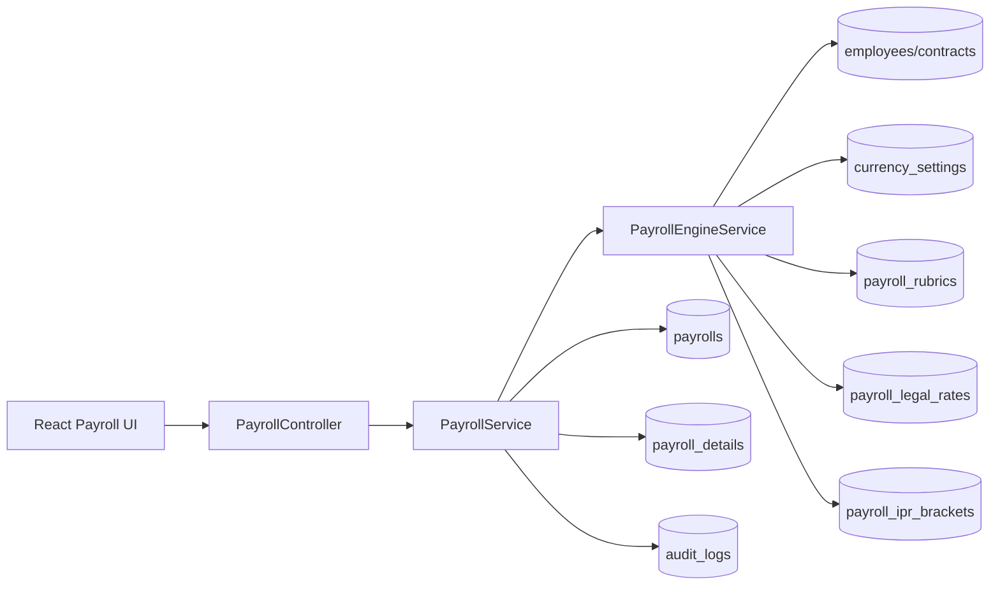
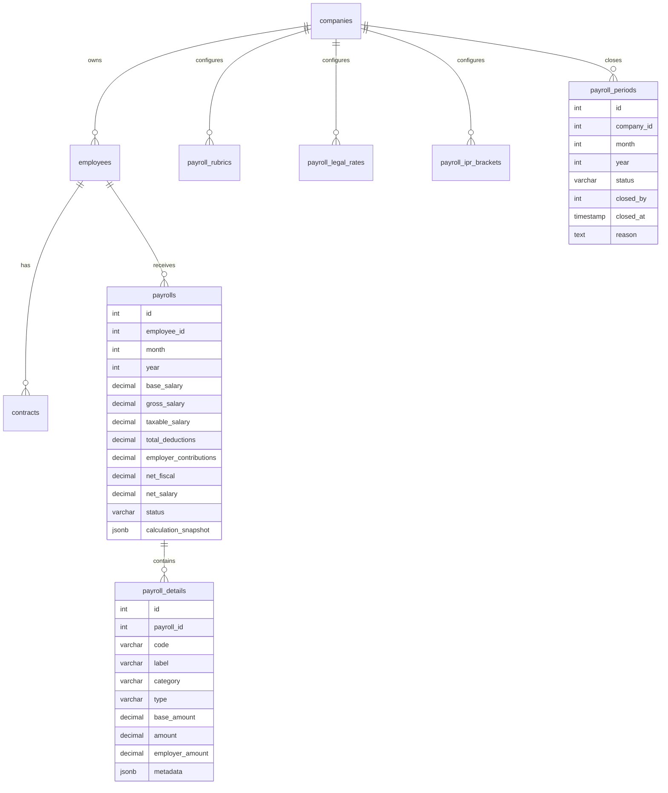
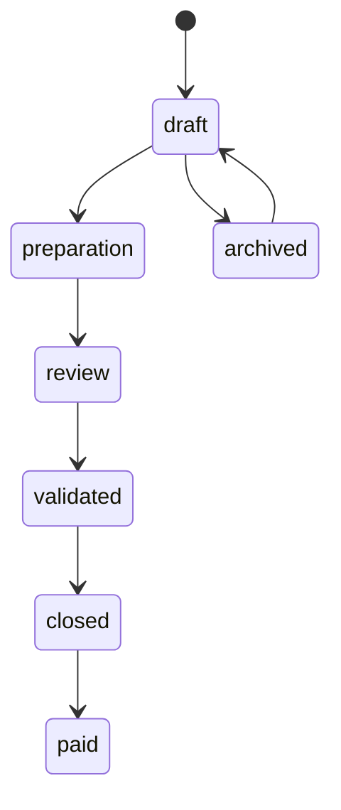

# SmartHR Payroll Enterprise Architecture

## Objectif

Le module Paie evolue vers un moteur parametable multi-entreprises adapte a la RDC. Le socle implemente conserve les fiches existantes, ajoute des rubriques configurables, des taux legaux historises, un bareme IPR versionne et un snapshot complet de calcul.

## Architecture NestJS



## Modeles principaux



## Workflow



## API REST

- `GET /api/payroll` : liste des fiches, filtrable par mois, annee, entreprise.
- `GET /api/payroll/summary` : masse salariale, brut, deductions, charges employeur.
- `POST /api/payroll/generate` : generation individuelle compatible avec l'ecran actuel.
- `POST /api/payroll/generate-batch` : generation collective asynchrone par entreprise/periode.
- `GET /api/payroll/jobs/:id` : suivi de progression du traitement collectif.
- `POST /api/payroll/jobs/:id/cancel` : annulation d'un traitement en attente ou en cours.
- `POST /api/payroll/engine/preview` : simulation sans persistance.
- `GET /api/payroll/engine/configuration` : rubriques, taux legaux, baremes IPR.
- `POST /api/payroll/engine/rubrics` : creation ou mise a jour d'une rubrique sans developpement.
- `POST /api/payroll/engine/legal-rates` : ajout d'une nouvelle version de taux legal.
- `POST /api/payroll/engine/ipr-brackets` : ajout d'une nouvelle tranche/version IPR.
- `GET /api/payroll/period/status` : statut d'ouverture ou de cloture d'une periode.
- `POST /api/payroll/period/close` : cloture une periode pour figer les modifications.
- `POST /api/payroll/period/reopen` : rouvre une periode avec audit.
- `PUT /api/payroll/:id/workflow/:status` : transition controlee du workflow.
- `GET /api/payroll/:id/payslip` : bulletin HTML imprimable ou enregistrable en PDF depuis le navigateur.
- `GET /api/payroll/:id/payslip-excel` : bulletin Excel natif `.xlsx`.
- `POST /api/payroll/:id/archive-payslip` : archive et signe le bulletin HTML genere.
- `GET /api/payroll/:id/documents` : liste les documents de paie archives.
- `GET /api/payroll/:id/documents/:documentId/download` : telecharge un document de paie archive.
- `GET /api/payroll/journal/export` : journal de paie CSV compatible Excel.
- `GET /api/payroll/journal/export-excel` : journal de paie Excel compatible `.xls`.
- `GET /api/payroll/journal/export-xlsx` : journal de paie Excel natif `.xlsx`.
- `GET /api/payroll/book/export-excel` : livre de paie consolide par departement en `.xls`.
- `GET /api/payroll/book/export-xlsx` : livre de paie consolide par departement en `.xlsx`.
- `GET /api/payroll/audit-trail` : piste d'audit paie de la periode.
- `POST /api/payroll/time-inputs/import-excel` : import temps/presence depuis fichier pointeuse `.xlsx`.

## Regles RDC actuellement seedees

- CNSS employe: 5%.
- CNSS employeur: 13%.
- INPP employeur: 1%.
- ONEM employeur: 0.2%.
- IPR: bareme progressif configurable, seed initial a 15%.

Ces valeurs sont parametrees dans `payroll_legal_rates` et `payroll_ipr_brackets`; une paie deja generee conserve son snapshot et ne change pas si les taux futurs changent.

## Administration des taux et baremes

Les administrateurs Paie peuvent ajouter:

- un taux legal versionne par entreprise ou globalement;
- une tranche IPR versionnee;
- une rubrique entreprise.

Chaque ajout conserve l'historique avec `effective_from`, `effective_to`, `version` et `created_by`. Le moteur choisit les lignes applicables a la periode de paie et les copie dans le snapshot de calcul.

## Snapshot de calcul

Chaque fiche stocke `calculation_snapshot` avec:

- version moteur;
- periode;
- employe et contrat utilises;
- devise et taux de change;
- rubriques actives;
- taux legaux applicables;
- bareme IPR applicable;
- totaux calcules.

Ce snapshot permet de reconstituer une paie plusieurs annees apres sa cloture.

## Generation collective

La generation collective cree une entree `payroll_generation_jobs` avec:

- statut: `queued`, `running`, `completed`, `completed_with_errors`, `cancelled`;
- nombre total d'employes;
- nombre traite;
- nombre de succes;
- nombre d'echecs;
- erreurs par employe en JSONB.

Le traitement continue meme si un employe echoue. Chaque fiche generee conserve son audit, et le job collectif est lui-meme audite sous l'entite `payroll_generation_jobs`.

L'execution passe par `PayrollBatchQueueService` afin d'isoler le lancement HTTP du traitement long. Deux modes sont prevus:

- `PAYROLL_BATCH_QUEUE_DRIVER=memory` : fallback local sans dependance externe, utile en developpement;
- `PAYROLL_BATCH_QUEUE_DRIVER=bullmq` : enfile les jobs dans Redis via BullMQ pour une execution externalisable.

Configuration:

```env
PAYROLL_BATCH_QUEUE_DRIVER=memory
PAYROLL_BATCH_QUEUE_NAME=payroll-generation
PAYROLL_BATCH_QUEUE_ATTEMPTS=1
REDIS_HOST=127.0.0.1
REDIS_PORT=6379
REDIS_PASSWORD=
```

Le mode BullMQ necessite un Redis accessible. Le fallback `memory` conserve le comportement precedent et evite de rendre le demarrage du backend dependant de Redis pendant le developpement.

## Cloture des periodes

La table `payroll_periods` permet de verrouiller une periode par entreprise, mois et annee. Une periode ouverte autorise les generations, modifications, variables RH, saisies temps et transitions de workflow. Une periode cloturee reste consultable et exportable, mais bloque toute action qui modifierait les montants ou le cycle de validation.

Operations controlees:

- consultation du statut avec `payroll:read`;
- cloture et reouverture avec `payroll:write`;
- audit de chaque cloture/reouverture dans `audit_logs`;
- blocage serveur dans `PayrollService` avant generation individuelle, generation collective, modification, variable RH et temps/presence;
- blocage UI sur les boutons de generation et d'ajustement.

Cette approche preserve les paies cloturees contre les recalculs involontaires tout en gardant une reouverture tracee pour les corrections autorisees.

## Audit operationnel Paie

L'ecran Paie affiche une carte `Tracabilite paie` pour la periode courante. Elle consolide les actions issues de `audit_logs`:

- generations individuelles et collectives;
- transitions de workflow;
- imports CSV variables et temps/presence;
- clotures et reouvertures de periode;
- changements de statut et archivages.

API:

- `GET /api/payroll/audit-trail?month=...&year=...&companyId=...`

Cette vue complete le journal d'audit global administrateur avec une lecture metier centree sur la periode de paie.

## Collecte des variables RH

Les elements variables sont stockes dans `payroll_variable_inputs`:

- primes, bonus, commissions et gratifications;
- indemnites ponctuelles;
- avances sur salaire;
- prets et retenues internes;
- retenues disciplinaires.

Chaque element est lie a un employe, une periode, une entreprise, un type (`allowance` ou `deduction`), une devise et un statut. Le moteur les collecte automatiquement lors d'une generation individuelle ou collective.

API:

- `GET /api/payroll/variables`
- `POST /api/payroll/variables`
- `POST /api/payroll/variables/import-csv`

L'ecran Paie expose un bouton `Ajouter variable`, un import CSV et une synthese des elements de la periode.

Format CSV variables:

```csv
matricule;code;label;type;category;amount;currency;taxable
EMP00031;PRIME;Prime rendement;allowance;variable_earning;150;USD;oui
EMP00032;AVANCE;Avance salaire;deduction;internal_deduction;25000;CDF;non
```

`employee_id` peut remplacer `matricule`. Les separateurs `;` et `,` sont acceptes.

## Temps et presence

Les saisies de temps sont stockees dans `payroll_time_inputs`:

- heures supplementaires;
- travail de nuit;
- travail dominical;
- jours feries travailles;
- absences non payees;
- retards.

API:

- `GET /api/payroll/time-inputs`
- `POST /api/payroll/time-inputs`
- `POST /api/payroll/time-inputs/import-csv`
- `POST /api/payroll/time-inputs/import-excel`

Coefficients actuels du socle:

- heures supplementaires: 130% du taux horaire;
- nuit: 150%;
- dimanche: 200%;
- ferie travaille: 200%;
- absence non payee: taux journalier base sur 26 jours;
- retard: taux horaire prorate.

Ces lignes sont integrees automatiquement aux gains/retenues lors de la generation individuelle ou collective.

Format CSV temps/presence:

```csv
matricule;overtime_hours;night_hours;sunday_hours;holiday_hours;unpaid_absence_days;late_minutes;notes
EMP00031;8;2;0;0;0;15;Pointage mensuel
EMP00032;0;0;4;0;1;0;Absence sans solde
```

Format Excel temps/presence:

- extension `.xlsx`;
- premiere feuille utilisee;
- premiere ligne = en-tetes;
- memes colonnes que le CSV;
- alias pointeuse acceptes: `badge`, `employee_code`, `code_employe`, `heures_travaillees`, `heures_prevues`, `heure_arrivee`, `heure_prevue`.

Exemple pointeuse:

| badge | heures_travaillees | heures_prevues | heure_arrivee | heure_prevue | notes |
| --- | ---: | ---: | --- | --- | --- |
| EMP00031 | 9 | 8 | 08:15 | 08:00 | Pointage mensuel |

Si `overtime_hours` ou `late_minutes` ne sont pas fournis, le backend peut les deduire de `heures_travaillees - heures_prevues` et de `heure_arrivee - heure_prevue`.

## Generation documentaire

Le socle documentaire fournit:

- bulletin individuel HTML imprimable, contenant employe, gains, retenues, charges employeur, net fiscal et net a payer;
- bulletin individuel Excel natif `.xlsx`;
- archivage long terme du bulletin HTML signe;
- export du journal de paie en CSV `;` avec BOM UTF-8, ouvrable dans Excel;
- export Excel SpreadsheetML du journal detaille;
- export Excel natif `.xlsx` du journal detaille;
- export Excel SpreadsheetML du livre de paie avec consolidation par departement et onglet journal detaille;
- export Excel natif `.xlsx` du livre de paie avec consolidation par departement et onglet journal detaille;
- boutons UI pour ouvrir un bulletin et exporter CSV, journal Excel et livre de paie.

La generation PDF native pourra ensuite etre ajoutee avec une librairie serveur dediee, mais l'HTML actuel permet deja l'enregistrement PDF via le navigateur sans dependance supplementaire. Les exports `.xls` historiques restent disponibles pour compatibilite, tandis que les endpoints `.xlsx` utilisent ExcelJS.

## Archivage et signature

La table `payroll_documents` conserve les bulletins archives avec:

- fiche de paie, employe et entreprise;
- type de document (`payslip`);
- nom, chemin de stockage, taille et type MIME;
- empreinte SHA-256 du fichier;
- statut de signature;
- signataire et date de signature.

Le stockage fichier utilise `PAYROLL_DOCUMENT_STORAGE_PATH`, par defaut `uploads/payroll-documents`. L'endpoint `POST /api/payroll/:id/archive-payslip` genere le bulletin HTML courant, calcule son empreinte, l'ecrit sur le stockage long terme et cree une signature liee a l'utilisateur authentifie. Chaque archivage et chaque telechargement sont audites dans `audit_logs` avec l'entite `payroll_documents`.

## Migration et compatibilite

Le module conserve les champs historiques de `payrolls` afin que les ecrans et rapports existants continuent de fonctionner. Les colonnes ajoutees enrichissent le calcul sans casser les integrations:

- `gross_salary`, `taxable_salary`, `net_fiscal` et `employer_contributions` ajoutent les totaux legaux et comptables;
- `currency` et `exchange_rate` conservent la devise de reference et le taux applique;
- `workflow_step` permet de suivre le cycle de validation sans perdre le champ `status`;
- `calculation_snapshot` fige les donnees ayant servi au calcul;
- `payroll_details` devient le detail officiel des gains, retenues et charges employeur.

La migration SQL est idempotente avec des `CREATE TABLE IF NOT EXISTS` et `ALTER TABLE ... ADD COLUMN IF NOT EXISTS`. Elle peut donc etre rejouee pendant les deploiements ou sur un environnement deja partiellement migre.

Ordre recommande de migration:

1. Sauvegarder la base.
2. Executer `database/upgrade_payroll_engine.sql`.
3. Demarrer le backend pour laisser les garde-fous `onModuleInit` completer les colonnes manquantes.
4. Verifier la configuration moteur via `GET /api/payroll/engine/configuration`.
5. Generer une paie de test en preview avant toute generation persistante.

## Controles financiers

Les controles ci-dessous structurent la separation des responsabilites:

- simulation autorisee avec `payroll:read`, sans persistance;
- saisie des variables RH avec `payroll:input` ou import avec `payroll:import`;
- generation reservee a `payroll:generate`;
- validation reservee a `payroll:validate`;
- cloture reservee a `payroll:close`;
- configuration des rubriques et taux reservee a `payroll:configure`;
- exports reservees a `payroll:export`.

Une fiche validee ou payee ne doit plus etre modifiee directement. Les corrections passent par une reouverture de periode, une nouvelle generation ou un ajustement trace selon le statut et les droits de l'utilisateur. Les exports doivent toujours etre produits depuis les donnees persistees, pas depuis une simulation.

## Observabilite et exploitation

Les points d'observation principaux sont:

- `audit_logs` pour les actions metier et administratives;
- `payroll_generation_jobs` pour suivre les traitements collectifs;
- `calculation_snapshot` pour diagnostiquer une fiche individuelle;
- exports journal/livre de paie pour les rapprochements comptables;
- tests moteur et integration API pour verifier les regressions.

Alertes recommandees:

- job collectif en `running` trop longtemps;
- job termine en `completed_with_errors`;
- generation bloquee par periode cloturee;
- taux legal ou bareme IPR absent pour une periode;
- ecart entre masse salariale attendue et journal exporte;
- reouverture de periode deja cloturee.

## Reconciliation comptable

Le livre de paie consolide par departement fournit les totaux attendus pour la comptabilite:

- salaire de base;
- salaire brut;
- salaire imposable;
- retenues salariales;
- charges employeur;
- net fiscal;
- net a payer.

Le journal detaille reste la source de rapprochement ligne par ligne. Les rubriques doivent porter un `code` stable afin de faciliter le mapping vers le plan comptable, les exports bancaires et les declarations sociales ou fiscales.

## Tests

Le socle contient une suite de tests sans dependance externe:

```bash
cd Backend
npm run test:payroll
```

Couverture actuelle:

- calcul brut/net avec prime;
- CNSS employe;
- IPR;
- charges employeur CNSS/INPP/ONEM;
- conversion USD vers CDF;
- variables gains/retenues;
- primes non imposables;
- temps/presence;
- snapshot de calcul;
- bareme progressif.

Une suite d'integration API couvre les flux exposes par NestJS:

```bash
cd Backend
npm run db:test:payroll
# Dans un autre terminal:
npm run start:test:payroll-api
# Puis:
npm run test:payroll:api
```

Prerequis: backend local demarre sur `http://localhost:3000/api` ou variable `API_BASE_URL` definie. La suite utilise automatiquement `PAYROLL_API_TEST_DB_NAME` quand aucune base n'est fournie explicitement, et refuse par defaut une base dont le nom ne contient pas `test` ou `ci`; `PAYROLL_API_ALLOW_SHARED_DB=true` permet de lever ce garde-fou explicitement.

Le script `npm run db:test:payroll` cree ou met a jour `smarthr_test` avec le schema applicatif et les upgrades paie. La suite cree ensuite sa propre entreprise et son propre employe de test, se connecte avec l'administrateur seed, utilise une periode future, verifie imports CSV, import pointeuse Excel, generation, workflow, exports Excel `.xls` et `.xlsx`, bulletin `.xlsx` et cloture de periode, puis nettoie ses donnees.

## Permissions

- `payroll:read` pour consulter et simuler.
- `payroll:write` reste supporte comme droit legacy global.
- `payroll:generate` pour generer une fiche ou lancer une generation collective.
- `payroll:update` pour modifier, archiver ou reactiver une fiche.
- `payroll:validate` pour faire avancer le workflow de validation.
- `payroll:close` pour cloturer ou rouvrir une periode.
- `payroll:export` pour telecharger bulletins, journaux et livres de paie.
- `payroll:configure` pour administrer rubriques, taux legaux et baremes IPR.
- `payroll:input` pour saisir variables RH et temps/presence.
- `payroll:import` pour importer variables et pointages depuis CSV.
- Les roles `admin` et `super_admin` restent autorises par le guard global.

## Prochains lots recommandes

1. Deployer Redis et activer `PAYROLL_BATCH_QUEUE_DRIVER=bullmq` sur les environnements de volume.
2. Ajouter la generation PDF serveur native si l'enregistrement PDF navigateur ne suffit plus.
