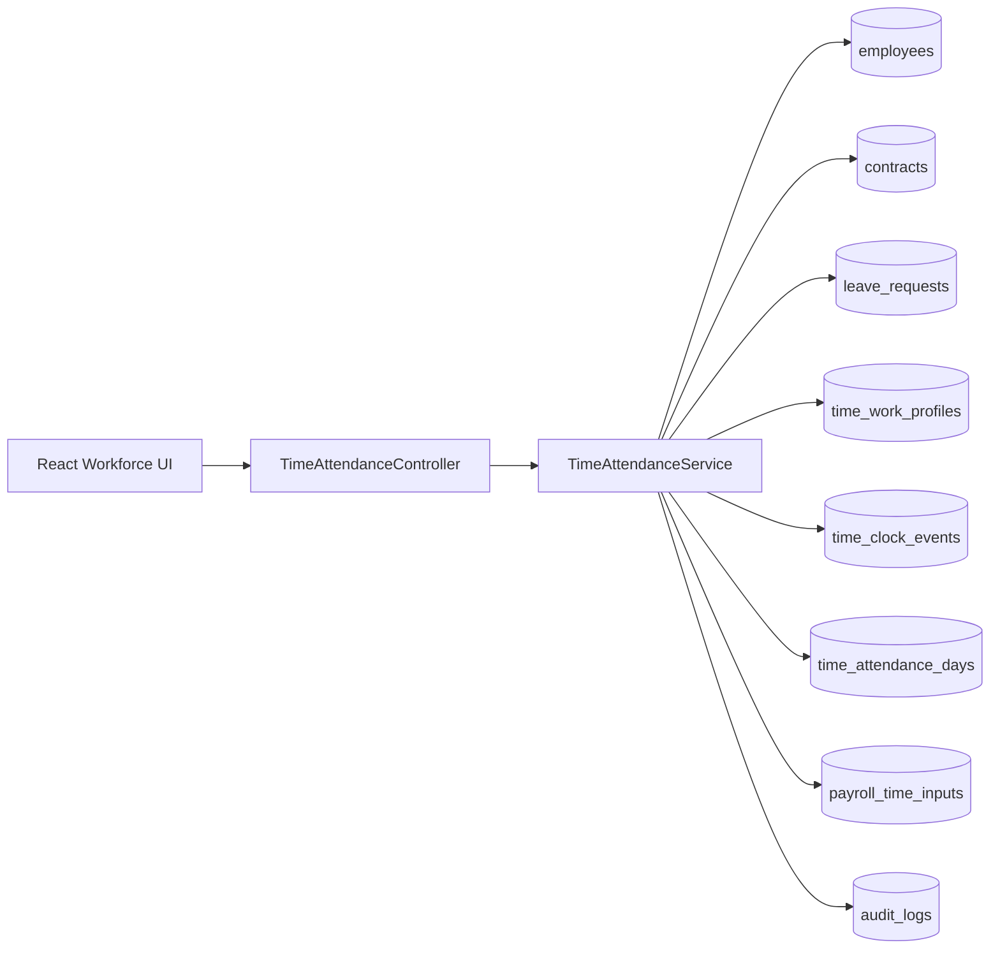
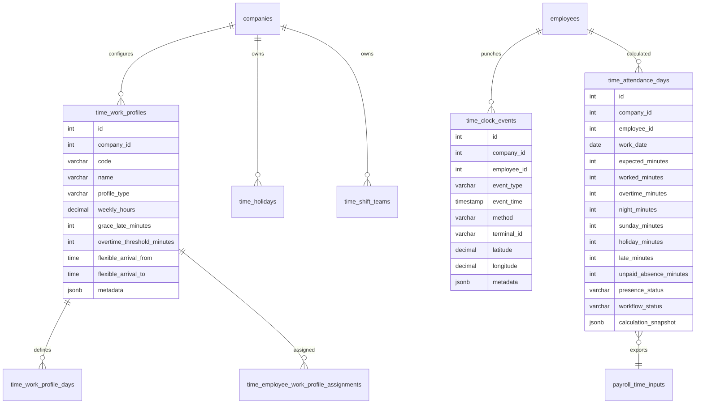
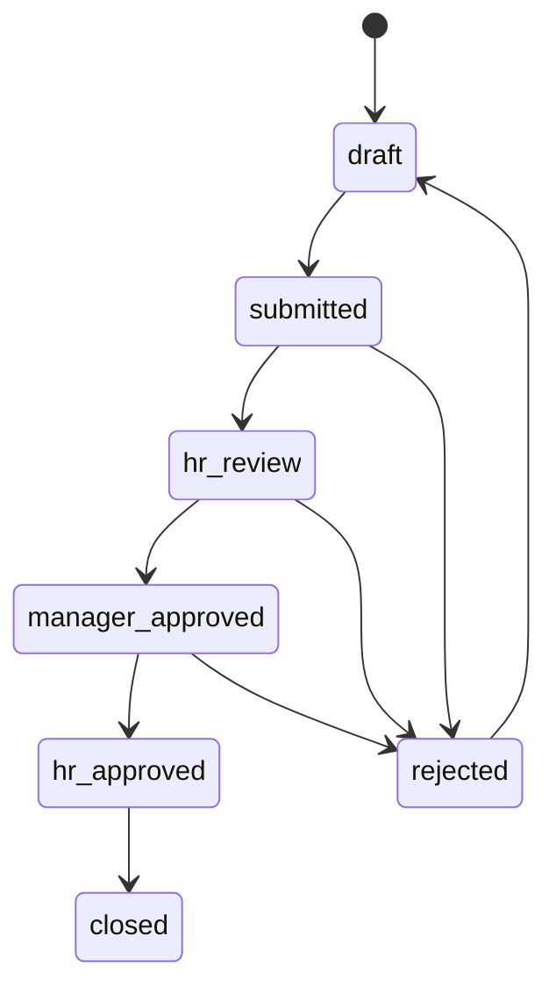

# SmartHR Time & Attendance Enterprise Architecture

## Objectif

Le module Temps et Presence transforme SmartHR en moteur Workforce Management configurable par entreprise. Il couvre les horaires, rotations, pointages, absences, retards, heures supplementaires, validation RH et alimentation automatique de la paie.

Le module est multi-entreprises par construction: chaque table metier porte `company_id`, les permissions sont granulaires et les calculs ne melangent jamais les donnees de plusieurs entreprises.

## Architecture NestJS



## Modeles principaux



## Adaptabilite multi-entreprises

Chaque entreprise peut configurer:

- profils horaires illimites;
- jours ouvrables;
- pauses;
- tolerances de retard;
- seuils d'heures supplementaires;
- jours feries;
- equipes et rotations;
- affectations par employe, departement, poste ou profil global;
- workflows de validation;
- methodes de pointage.

L'ordre de priorite des affectations est:

1. employe;
2. poste;
3. departement;
4. affectation globale de l'entreprise.

Exemples:

- administration: lundi-vendredi, 08h00-17h00, pause 12h00-13h00;
- mine: rotation 14/7 avec equipes jour/nuit;
- securite: rotation continue 24/24;
- temps partiel: profil reduit par employe.

## Workflow



Le workflow par defaut est expose par le backend. La table `time_approval_workflows` permet de stocker des workflows specifiques par entreprise via une liste JSONB de steps.

## API REST

- `GET /api/time-attendance/configuration` : profils horaires, jours, feries, equipes et workflows.
- `POST /api/time-attendance/work-profiles` : cree ou met a jour un profil horaire.
- `POST /api/time-attendance/holidays` : cree ou met a jour un jour ferie entreprise.
- `POST /api/time-attendance/teams` : cree ou met a jour une equipe/rotation.
- `POST /api/time-attendance/rotations` : cree ou met a jour un modele de rotation travail/repos ou jour/nuit.
- `POST /api/time-attendance/assignments` : affecte un profil horaire.
- `POST /api/time-attendance/clock-events` : enregistre un pointage entree/sortie.
- `POST /api/time-attendance/clock-events/import` : importe un lot de pointages terminal RFID/biometrie/API.
- `POST /api/time-attendance/schedule/generate` : genere un planning par periode depuis une rotation ou un profil fixe.
- `GET /api/time-attendance/schedule` : consulte le planning genere par employe, equipe, rotation et periode.
- `POST /api/time-attendance/schedule/:id` : corrige manuellement une ligne de planning, deplace la date, change le profil/statut/heures et peut recalculer la journee.
- `POST /api/time-attendance/alerts/detect` : detecte les alertes retard, absence, oubli de pointage et depart anticipe.
- `GET /api/time-attendance/alerts` : consulte les alertes par statut, type, employe et periode.
- `POST /api/time-attendance/alerts/:id/status` : accuse, rejette ou resout une alerte.
- `GET /api/time-attendance/notifications/outbox` : consulte la file de notifications par statut, canal et limite.
- `POST /api/time-attendance/notifications/dispatch` : traite l'outbox interne/email et simule les providers SMS/WhatsApp si demande.
- `POST /api/time-attendance/notifications/:id/retry` : remet une notification non envoyee en file d'attente.
- `POST /api/time-attendance/days/calculate` : calcule les journees d'une periode.
- `POST /api/time-attendance/days/calculate/async` : lance le calcul en tache de fond avec suivi de job.
- `GET /api/time-attendance/days` : liste les journees calculees.
- `POST /api/time-attendance/days/:id/workflow/:status` : fait avancer une journee dans le workflow.
- `POST /api/time-attendance/alerts/detect/async` : lance la detection des alertes en tache de fond.
- `POST /api/time-attendance/notifications/dispatch/async` : lance le dispatch notifications en tache de fond.
- `GET /api/time-attendance/jobs` : liste les jobs temps recents d'une entreprise.
- `GET /api/time-attendance/jobs/:id` : consulte le detail d'un job temps.
- `POST /api/time-attendance/jobs/:id/cancel` : annule un job en attente ou en cours.
- `POST /api/time-attendance/payroll/export` : exporte les agregats approuves vers `payroll_time_inputs`.
- `GET /api/time-attendance/dashboard` : KPI temps/presence pour une date.
- `GET /api/time-attendance/analytics` : tendances, repartition statuts, analyse departements et top retards/heures supplementaires.

Tous les endpoints acceptent `companyId` en query ou `X-Company-ID`.

## Moteur de calcul

Le moteur journalier calcule:

- temps attendu;
- temps travaille;
- pauses;
- temps normal;
- heures supplementaires;
- heures de nuit;
- heures dominicales;
- heures jours feries;
- retards;
- departs anticipes;
- absences non payees;
- statut presence: `present`, `absent`, `leave`, `off`.

Sources utilisees:

- profil horaire applicable;
- jours feries de l'entreprise;
- pointages entree/sortie;
- conges approuves dans `leave_requests`;
- donnees employe: entreprise, departement, poste.

Chaque calcul stocke un `calculation_snapshot` contenant le profil, le conge eventuel, le jour ferie et les IDs des pointages utilises.

## Integration paie

L'export paie agrege les journees `hr_approved` ou `closed` sur le mois:

- `overtime_minutes` -> `overtime_hours`;
- `night_minutes` -> `night_hours`;
- `sunday_minutes` -> `sunday_hours`;
- `holiday_minutes` -> `holiday_hours`;
- `unpaid_absence_minutes` -> `unpaid_absence_days`;
- `late_minutes` -> `late_minutes`.

Les donnees sont inserees dans `payroll_time_inputs` avec une note technique `TA_AUTO:mois/annee`. Avant chaque export, les lignes automatiques de la periode sont remplacees pour eviter les doublons.

## Methodes de pointage

Le champ `method` accepte une architecture ouverte:

- `manual`;
- `rfid`;
- `nfc`;
- `biometric`;
- `fingerprint`;
- `face`;
- `qr`;
- `mobile`;
- `gps`;
- `api_terminal`.

Les champs `terminal_id`, `location_label`, `latitude`, `longitude` et `metadata` permettent de brancher des terminaux externes sans changer le schema.

## Dashboard analytique

`GET /api/time-attendance/dashboard` fournit:

- effectif actif;
- presents;
- absents;
- retards;
- heures supplementaires;
- repartition par departement.

Les dashboards front peuvent ensuite filtrer par entreprise, departement, site, equipe, employe et periode.

## Audit

Toutes les actions structurantes sont auditees dans `audit_logs`:

- creation/modification de profil;
- jour ferie;
- equipe;
- affectation;
- pointage;
- calcul journalier;
- transition workflow;
- export paie.

Chaque ligne conserve `user_id`, `action`, `entity`, `entity_id`, `ip_address` et `details`.

## Permissions

- `time:read` : consulter configuration, journees et dashboards.
- `time:write` : droit legacy global.
- `time:configure` : profils, feries, equipes, affectations.
- `time:input` : pointage manuel ou import terminal.
- `time:calculate` : calculer les journees.
- `time:validate` : valider les journees.
- `time:export` : exporter vers la paie.
- `time:import` : importer depuis terminaux ou fichiers.

Les roles `admin` et `super_admin` heritent de toutes les permissions via le seed global. `rh_manager` recoit l'ensemble des permissions `time:*`, `supervisor` recoit consultation et validation, `company` recoit consultation.

## Performance et scalabilite

Principes retenus:

- index `time_clock_events(employee_id, event_time)`;
- index `time_attendance_days(company_id, work_date)`;
- index d'affectation par scopes;
- calcul par periode et employe;
- exports paie idempotents;
- table de snapshots pour diagnostic;
- compatibilite avec traitement asynchrone, annulation de jobs en attente et protection contre l'ecrasement d'un statut annule par une fin tardive de worker.

Pour plus de 50 000 employes:

- externaliser `days/calculate` via BullMQ/Redis;
- partitionner `time_clock_events` et `time_attendance_days` par mois;
- batcher les calculs par entreprise/site;
- garder les dashboards sur vues materialisees ou tables d'agregats;
- archiver les pointages bruts anciens en stockage froid.

## Tests

Verification backend:

```bash
cd Backend
npm run build
npm run test:time-attendance
```

Tests paie existants:

```bash
cd Backend
npm run test:payroll
npm run db:test:payroll
# Dans un autre terminal:
npm run start:test:payroll-api
# Puis:
npm run test:payroll:api
```

Le test `time-attendance` couvre le calcul journalier de base, les shifts de nuit traversant minuit, l'import terminal, la generation et correction de planning, la detection d'alertes, l'outbox notifications, la mise en file de jobs async, le respect des jobs annules et l'audit des echecs de jobs.

Les tests d'integration paie gardent la validation de l'alimentation `payroll_time_inputs`. Une suite dediee plus large pourra ensuite couvrir les cas rotation 14/7, nuit, dimanche, feries et workflows configures.

## Interface React livree

La premiere interface entreprise est disponible dans `Frontend/src/pages/company/CompanyTimeAttendance.jsx` et expose:

- KPI temps et presence par entreprise;
- creation rapide de profils horaires standards;
- pointage manuel compatible avec les methodes RFID/mobile/GPS/API prevues par l'architecture;
- import terminal par lot avec detection de doublons via `external_reference`;
- creation de modeles de rotation;
- generation du planning par periode;
- consultation des lignes de planning generees;
- calendrier planning avec deplacement par date et edition rapide profil/statut/heures;
- filtres planning par employe et equipe avec vues mois/semaine;
- navigation planning precedente/suivante et synthese de charge par equipe sur la periode visible;
- detection et traitement des alertes temps;
- consultation, dispatch et retry de l'outbox de notifications;
- lancement de calculs, alertes et dispatchs en tache de fond avec suivi de jobs;
- calcul par periode;
- validation RH d'une journee;
- export des donnees approuvees vers la paie.
- calendrier mensuel de presence;
- graphiques de tendance, departements et repartition des statuts.

La navigation entreprise expose le module via `/app/:companyId/time-attendance`.

## Prochains lots recommandes

1. Ajouter affectation drag-and-drop multi-employes/equipes avec vues semaine et mois.
2. Completer l'industrialisation BullMQ/Redis avec workers dedies et supervision operateur.
3. Ajouter tests d'integration dedies aux rotations, jours feries, corrections planning et alertes.
4. Brancher les fournisseurs reels email, SMS et WhatsApp sur `time_notification_outbox`.
5. Ajouter connecteurs reels terminaux RFID/biometrie par fournisseur.
